# CarDashCam with RF Data 🛰️📹

**Android Telemetry Pilot** is a high-performance Android application designed for real-time cellular telemetry monitoring, synchronized video recording, and low-latency network offloading. It serves as a mobile sensor hub for field testing and remote monitoring scenarios.


App is currently on Play Store undergoing testing, if intersted to download and participate onbeta testing, just send your email to android.xappslab@gmail.com - we'll send you a link to download from Play Store.

---

## 🚀 Key Features

- **Real-Time Telemetry HUD**: Monitor critical network metrics (5G NR/LTE), GPS coordinates, speed, and heading via a professional glassmorphic interface.
- **Integrated OpenStreetMap (OSM)**: Live map tracking using OpenStreetMap for offline-capable, high-detail navigation data.
- **On-Screen Display (OSD) Burn-in**: Automatically overlay telemetry data directly onto video frames before encoding, ensuring your data is permanently baked into the footage.
- **High-Performance Video Engine**: Records H.264/AVC video synchronized with telemetry logs.
- **Low-Latency Streaming**: Real-time JPEG-over-TCP offloading to companion receivers (e.g., MSI Claw, PC) for remote monitoring.
- **Local Persistence**: Integrated Room Database for logging every telemetry tick, searchable by linked video filename.
- **Modern UI/UX**: Dark-themed, neon-accented HUD designed for high visibility in field environments.

---

## 🛠️ Technical Stack

- **Language**: Kotlin 1.9.22
- **Camera Pipeline**: [CameraX](https://developer.android.com/training/camerax) (ImageAnalysis & Preview)
- **Database**: [Room](https://developer.android.com/training/data-storage/room)
- **Map Engine**: [osmdroid](https://github.com/osmdroid/osmdroid) for OpenStreetMap integration.
- **Location**: Google Play Services (Fused Location Provider)
- **Networking**: Raw Sockets (TCP) with custom frame headers
- **Architecture**: MVVM with Kotlin Coroutines and StateFlow
- **Encoder**: MediaCodec (Hardware-accelerated H.264)

---

## 📲 Installation & Demo

You can download the latest demo APK from the [Releases](https://github.com/tahgoi/demo-androidAPP-CarDashCamWithRFData/releases) section.

### Prerequisites
- Android 10 (API 29) or higher.
- Active SIM card for cellular telemetry.
- GPS enabled for location tracking.

### Permissions Required
- **Camera**: For viewfinder and video recording.
- **Location (Fine)**: For GPS tracking and cellular signal details (Android requirement).
- **Phone State**: For reading network technology (LTE/5G) and signal metrics.
- **Storage/Media**: For saving recordings and snapshots.

---

## 🖥️ Usage

1.  **Grant Permissions**: Accept all permission prompts on the first launch.
2.  **Mode Toggle**: Use the camera icon to switch between **Photo** (Snapshot) and **Video** (Recording) modes.
3.  **OSD Toggle**: Use the overlay icon to enable/disable the data burn-in on the video stream.
4.  **Network Stream**: Configure the **Target IP/Port** in Settings to stream live frames to a receiver.
5.  **Settings**: Access the gear icon to adjust logging preferences, receiver IP, and UI themes.

---

## 🛠️ Development Setup

1.  Clone the repository:
    ```bash
    git clone https://github.com/tahgoi/demo-androidAPP-CarDashCamWithRFData.git
    ```
2.  Open in **Android Studio (Ladybug or newer)**.
3.  Sync Gradle and build the project.
4.  Run on a physical device (Emulators do not support cellular telemetry).

---

## 📄 License

This project is licensed under the MIT License - see the [LICENSE](LICENSE) file for details.

---
*Developed for advanced telemetry field research.*

---

## 📸 Screenshots

### Intro — Real-World Setup

<table align="center">
  <tr>
    <td align="center" colspan="2">
      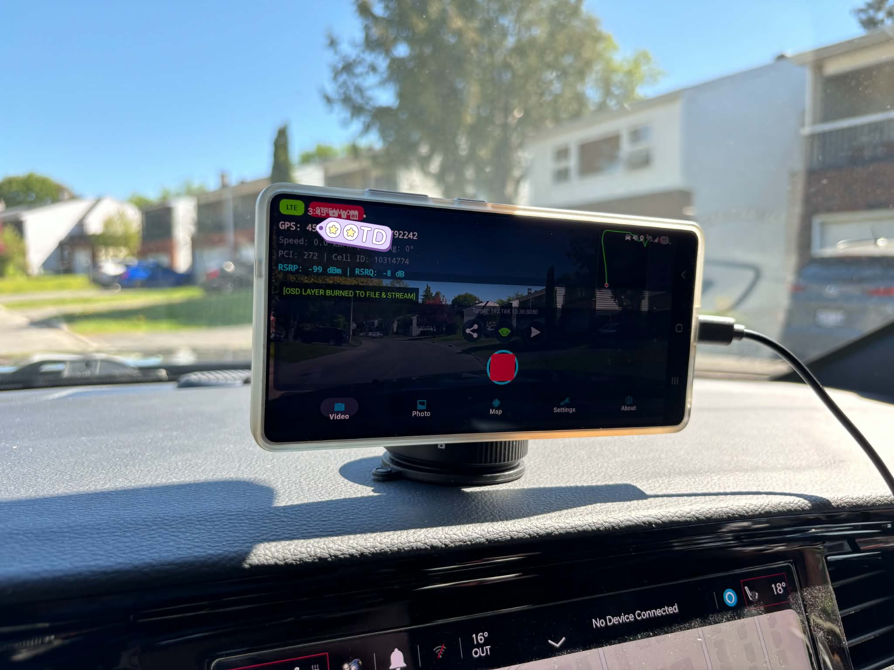
      <br/><sub><b>Recommended Mounting</b> — windshield bracket at driver's eye level for optimal GPS signal and unobstructed video angle</sub>
    </td>
  </tr>
  <tr>
    <td align="center">
      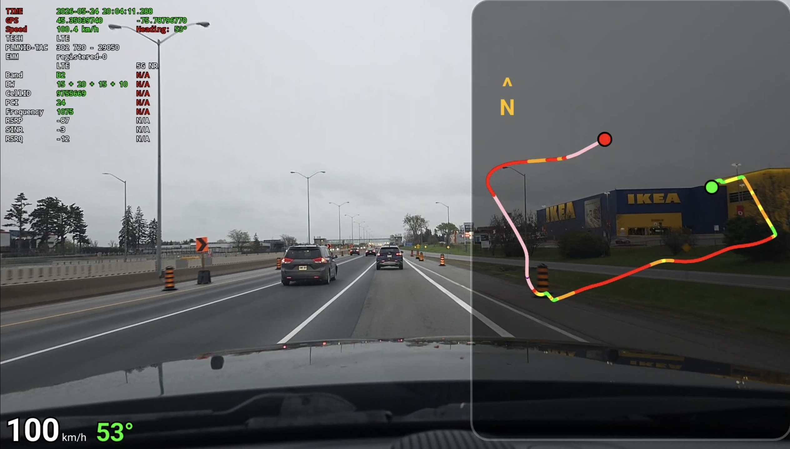
      <br/><sub><b>RF Mode — Live Drive</b> — LTE/5G metrics, GPS, speed, and heading overlaid in real-time during an actual trip</sub>
    </td>
    <td align="center">
      
      <br/><sub><b>Traveller Mode — Live Drive</b> — simplified GPS + time OSD for everyday use without RF data clutter</sub>
    </td>
  </tr>
</table>

---

### Page 1 — Video Recording &amp; OSD Modes

<table align="center">
  <tr>
    <td align="center" colspan="3">
      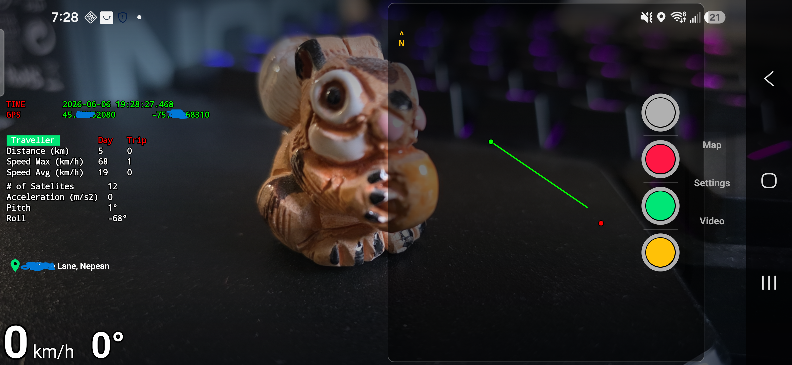
      <br/><sub><b>Standby</b> — camera preview active with HUD overlay, ready to start recording</sub>
    </td>
  </tr>
  <tr>
    <td align="center"><br/><sub>Replay Today's Trip</sub></td>
    <td align="center">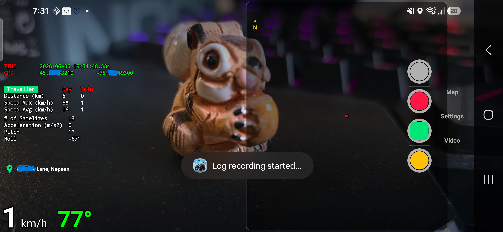<br/><sub>Log-Only Recording</sub></td>
    <td align="center">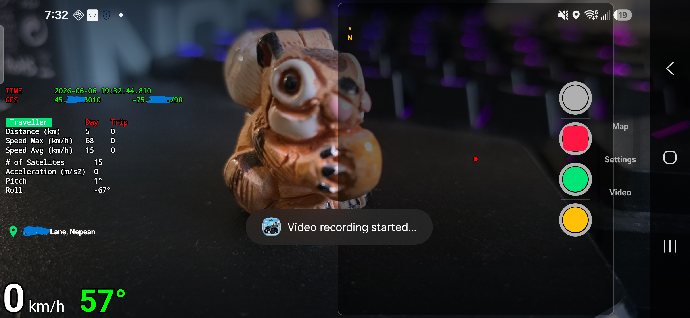<br/><sub>Video Recording Active</sub></td>
  </tr>
  <tr>
    <td align="center">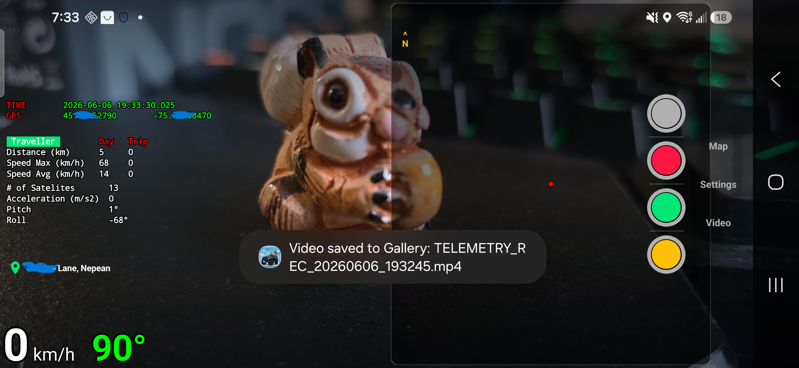<br/><sub>Recording Stopped</sub></td>
    <td align="center">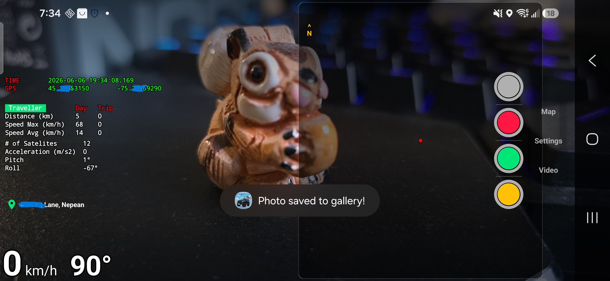<br/><sub>Photo Capture</sub></td>
    <td align="center">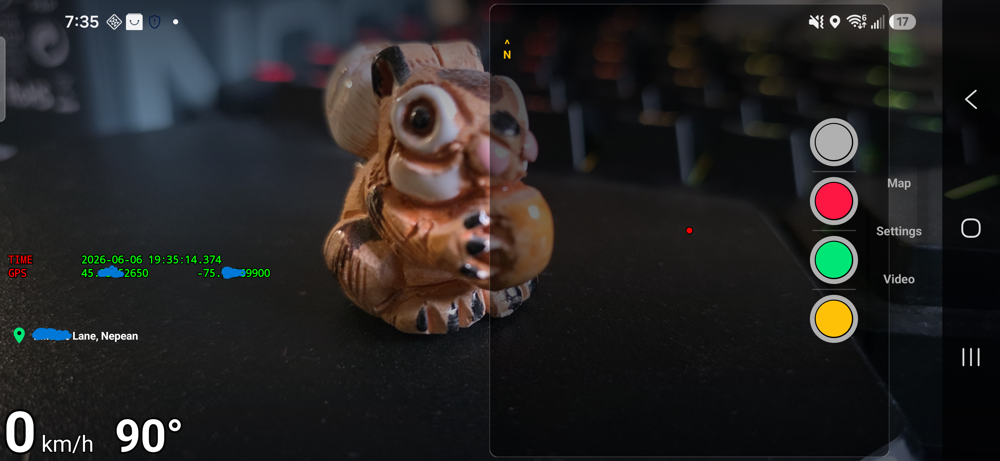<br/><sub>OSD Mode 1 — GPS &amp; Time Only</sub></td>
  </tr>
  <tr>
    <td align="center">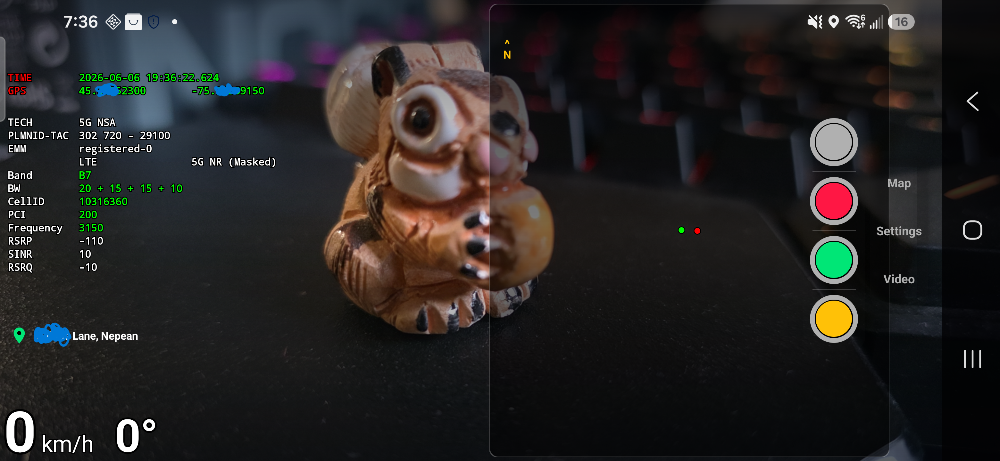<br/><sub>OSD Mode 2 — GPS + RF Data</sub></td>
    <td align="center">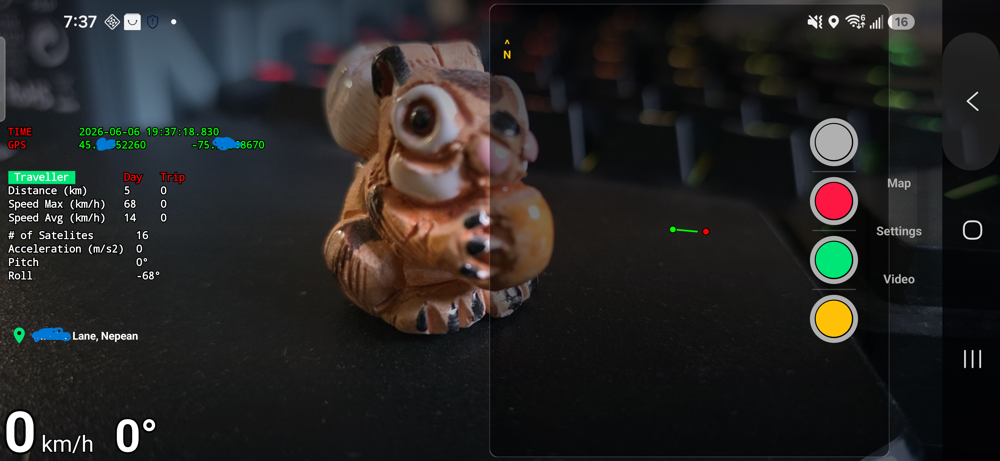<br/><sub>OSD Mode 3 — Navigation Info</sub></td>
    <td align="center"></td>
  </tr>
</table>

---

### Page 2 — Map &amp; Route Replay

<table align="center">
  <tr>
    <td align="center" colspan="3">
      
      <br/><sub><b>Map Overview</b> — live breadcrumb trail plotted on OpenStreetMap as the drive progresses</sub>
    </td>
  </tr>
  <tr>
    <td align="center">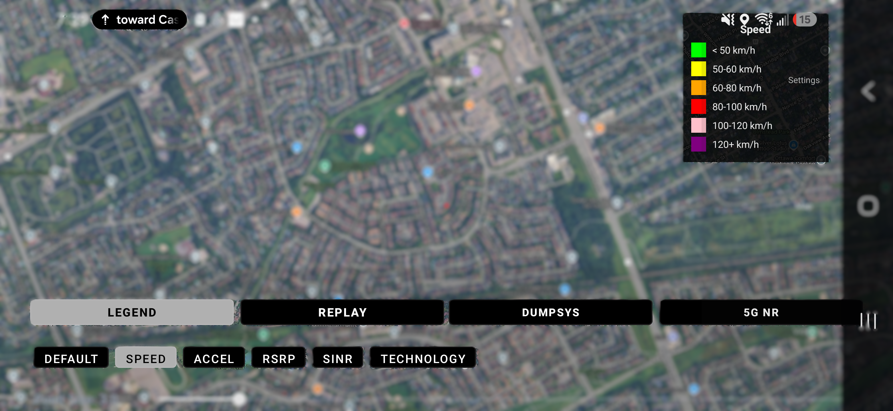<br/><sub>Legend &amp; Layer Controls</sub></td>
    <td align="center"><br/><sub>Replay Logs — select a past trip</sub></td>
    <td align="center">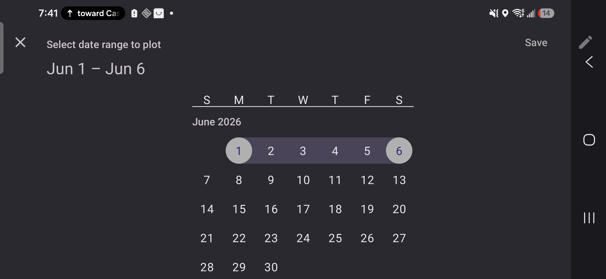<br/><sub>Date Range Filter</sub></td>
  </tr>
  <tr>
    <td align="center"><br/><sub>Route Replay — path plotted on map</sub></td>
    <td align="center">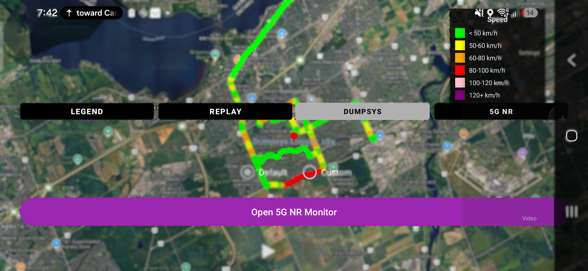<br/><sub>RF Info Panel — live signal analysis</sub></td>
    <td align="center">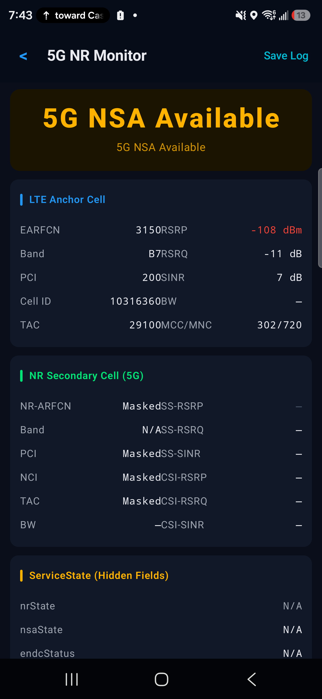<br/><sub>RF Dumpsys Detail</sub></td>
  </tr>
</table>

---

### Page 3 — Settings &amp; Configuration

<table align="center">
  <tr>
    <td align="center">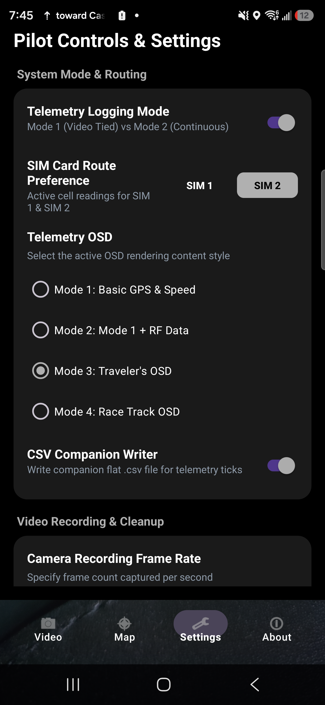<br/><sub>System Mode — RF or Traveller</sub></td>
    <td align="center">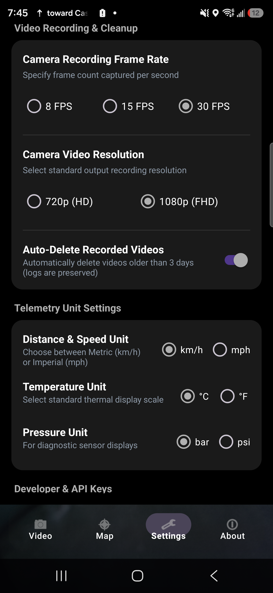<br/><sub>Recording &amp; Telemetry Options</sub></td>
    <td align="center">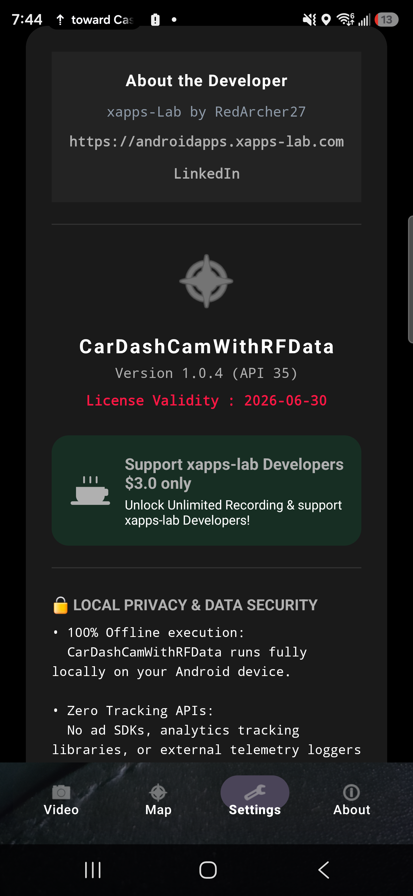<br/><sub>About &amp; Open Source Licenses</sub></td>
  </tr>
  <tr>
    <td align="center">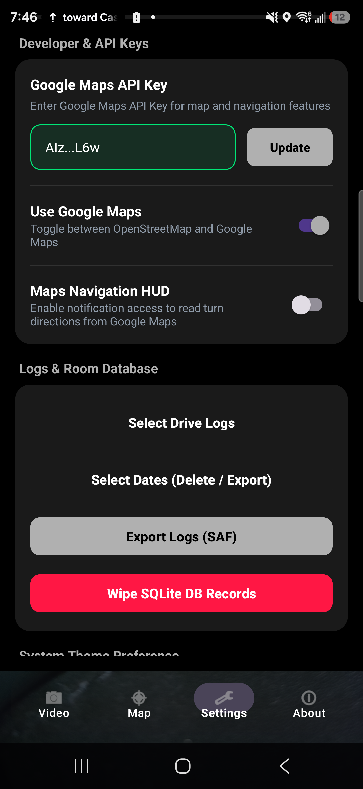<br/><sub>API Key &amp; Database Management</sub></td>
    <td align="center"></td>
    <td align="center"></td>
  </tr>
</table>
